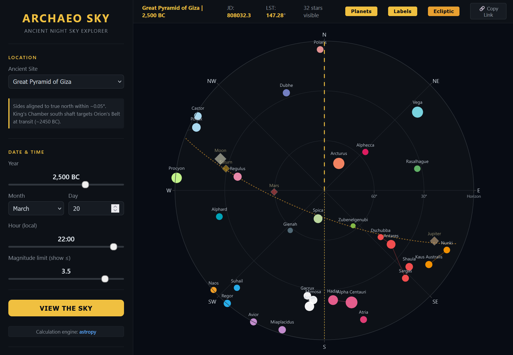
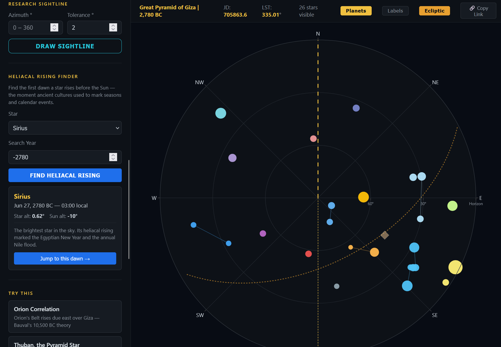
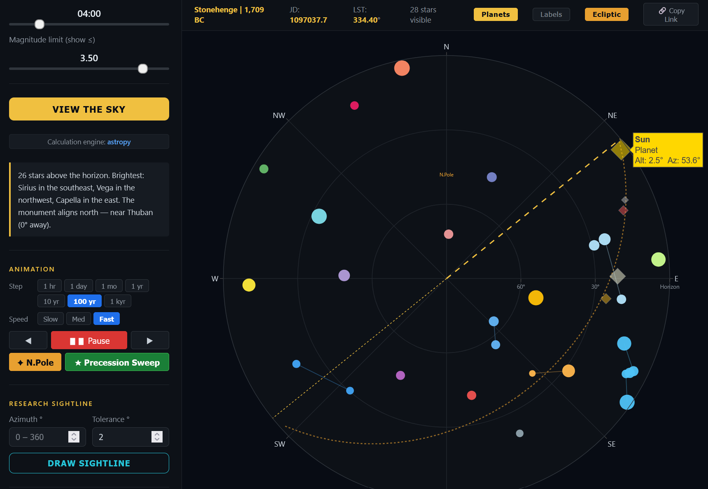

# Archaeo-Astronomy Sky Explorer

An interactive web app for reconstructing the ancient night sky at historical sites, accounting for stellar proper motion and axial precession over thousands of years.



---

## Features

- **Polar sky chart:** North-up, horizon-to-zenith radial view powered by Plotly.js
- **60 historically significant stars** with proper motion applied back to any epoch
- **13 ancient monument sites** (Giza, Stonehenge, Angkor Wat, Göbekli Tepe, Machu Picchu, and more) with known astronomical orientations
- **Custom coordinates:** enter any latitude/longitude for off-catalog sites
- **Magnitude limit slider:** filter stars by brightness (adjustable from 0 to 6.5)
- **Planet positions:** Sun, Moon, Mercury, Venus, Mars, Jupiter, Saturn in alt-az
- **Ecliptic overlay:** dotted great circle showing the path of the Sun/Moon/planets
- **Constellation lines:** stick figures connecting stars within each constellation
- **Star/planet labels:** toggle name labels on all objects
- **Time animation:** step or play forward/backward in 1h / 1d / 1mo / 1yr increments
- **Precession sweep:** watch the North Celestial Pole trace its 26,000-year arc; animate in 10yr / 100yr / 1kyr steps
- **Heliacal rising finder:** find the exact date a star first appears at dawn after a period of solar conjunction
- **URL permalink:** every state (site, date, toggles) is encoded in the URL; share or bookmark any view



---

## How to run locally

**1. Clone the repo and create a virtual environment**

```bash
git clone https://github.com/your-username/Archaeo-astronomy.git
cd Archaeo-astronomy
python -m venv venv
```

**2. Activate the virtual environment**

On Windows:
```bash
venv\Scripts\activate
```

On macOS / Linux:
```bash
source venv/bin/activate
```

**3. Install dependencies**

```bash
pip install -r requirements.txt
```

**4. Run the Flask server**

```bash
python app.py
```

**5. Open in your browser**

Navigate to `http://127.0.0.1:5000`

---

## Project structure

```
app.py              Flask server and API endpoints
src/
  alignment.py      Astronomical calculations (precession, proper motion, heliacal rising)
  data.py           Star catalog (60 stars, J2000 positions + proper motion) and monument list
  visualize.py      Static chart export helpers
templates/
  index.html        Single-page app, all UI and Plotly.js rendering
requirements.txt
```

---

## Calculation engine

The backend uses a **dual-engine** approach based on date range:

| Epoch | Engine | Notes |
|---|---|---|
| After ~4800 BC | **astropy** | Full ICRS to GCRS to AltAz transform with proper motion applied at J2000 + dt |
| Before ~4800 BC | **Meeus/Lieske** | Manual precession matrix (IAU 1976 + Lieske 1977 zeta/theta/z); same proper-motion offset |

Stellar proper motion is applied by nudging J2000 RA/Dec by `pm x dt` before the coordinate transform, giving physically accurate star positions back at least 10,000 years.

The **ecliptic overlay** uses astropy's `GeocentricTrueEcliptic` frame, which automatically handles the precession of the ecliptic plane for any historical epoch.

**Heliacal rising** is found by scanning 460 days starting from the prior October, checking each dawn (binary search on Sun altitude = arc-vision threshold, default -10 degrees) whether the target star is above the horizon and the Sun is below it.



---

## API endpoints

| Endpoint | Parameters | Description |
|---|---|---|
| `GET /api/stars` | `lat, lon, year, month, day, hour, site` | Star + planet alt-az positions |
| `GET /api/ecliptic` | same as `/api/stars` | 73 ecliptic great-circle points in alt-az |
| `GET /api/heliacal` | `lat, lon, year, star, arc_vision, site` | First heliacal rising date for a star |
| `GET /api/sites` | none | List of all monument sites with coordinates and orientation notes |

`year` uses astronomical convention: -2500 = 2501 BC, 0 = 1 BC, 1 = 1 AD.

---

## Dependencies

- **Flask:** web server
- **astropy:** high-precision coordinate transforms and epoch handling
- **numpy:** vector math for the Meeus fallback path
- **Plotly.js** (CDN): interactive polar chart in the browser
