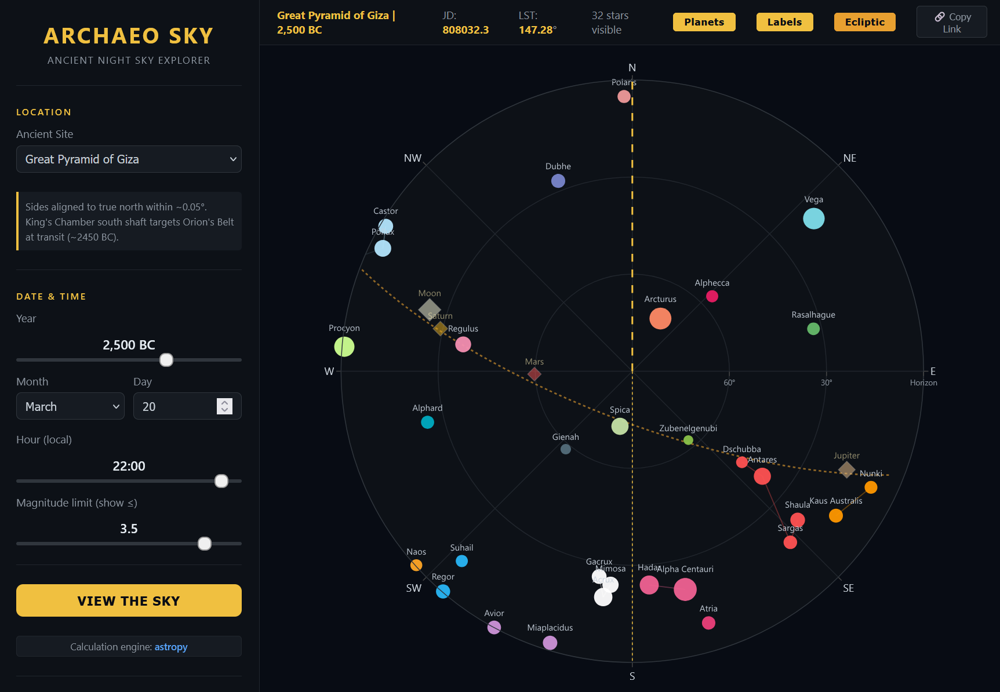
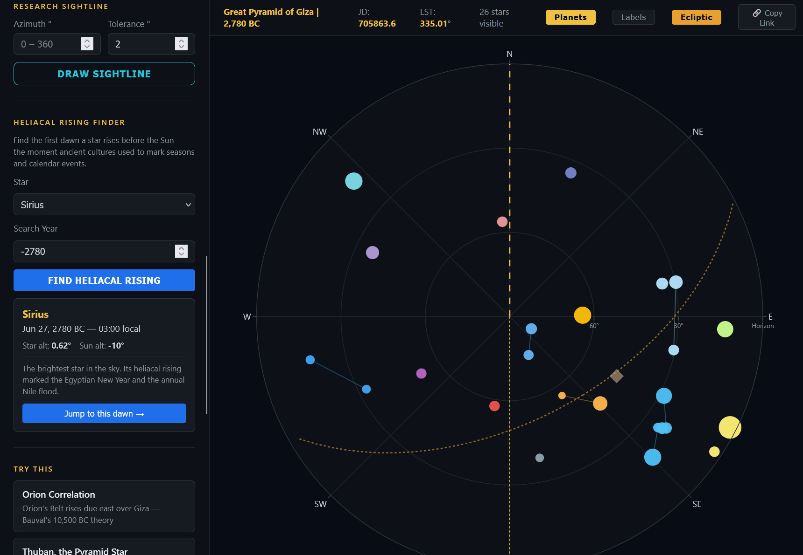
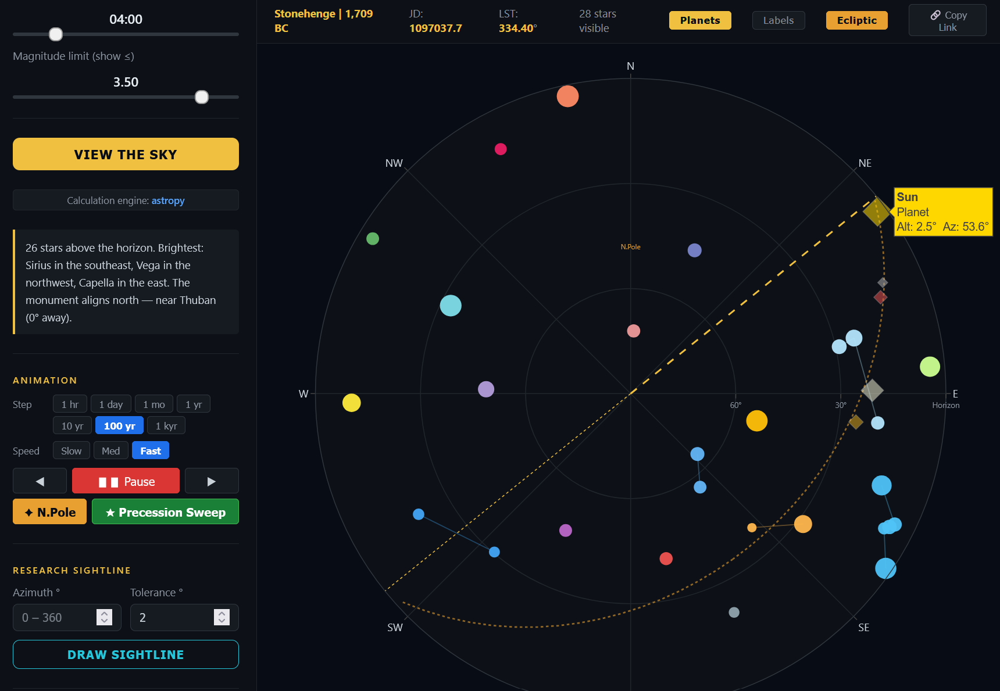

# Archaeo-Astronomy Sky Explorer

An interactive web app for reconstructing the ancient night sky at historical sites, accounting for stellar proper motion and axial precession over thousands of years.



---

## Features

- **Polar sky chart:** North-up, horizon-to-zenith radial view powered by Plotly.js
- **60 historically significant stars** with proper motion applied back to any epoch
- **13 ancient monument sites** (Giza, Stonehenge, Angkor Wat, Göbekli Tepe, Machu Picchu, and more) with known astronomical orientations
- **Custom coordinates:** enter any latitude/longitude for off-catalog sites
- **Magnitude limit slider:** filter stars by brightness (adjustable from 0 to 6.5)
- **Planet positions:** Sun, Moon, Mercury, Venus, Mars, Jupiter, Saturn in alt-az
- **Ecliptic overlay:** dotted great circle showing the path of the Sun/Moon/planets
- **Constellation lines:** stick figures connecting stars within each constellation
- **Star/planet labels:** toggle name labels on all objects
- **Time animation:** step or play forward/backward in 1h / 1d / 1mo / 1yr increments
- **Precession sweep:** watch the North Celestial Pole trace its 26,000-year arc; animate in 10yr / 100yr / 1kyr steps
- **Heliacal rising finder:** find the exact date a star first appears at dawn after a period of solar conjunction
- **URL permalink:** every state (site, date, toggles) is encoded in the URL; share or bookmark any view
- **Gregorian or Julian dates:** read dates the way modern astronomers or historical sources give them



---

## How to run locally

**1. Clone the repo and create a virtual environment**

```bash
git clone https://github.com/your-username/Archaeo-astronomy.git
cd Archaeo-astronomy
python -m venv venv
```

**2. Activate the virtual environment**

On Windows:
```bash
venv\Scripts\activate
```

On macOS / Linux:
```bash
source venv/bin/activate
```

**3. Install dependencies**

```bash
pip install -r requirements.txt
```

**4. Run the Flask server**

```bash
python app.py
```

Debug mode (auto-reload and the in-browser debugger) is off by default, because the debugger can run code sent from the browser. To turn it on while developing, set `FLASK_DEBUG=1` first (`set FLASK_DEBUG=1` in Windows cmd, `$env:FLASK_DEBUG=1` in PowerShell, `export FLASK_DEBUG=1` on macOS / Linux).

**5. Open in your browser**

Navigate to `http://127.0.0.1:5000`

---

## Project structure

```
app.py              Flask server and API endpoints
src/
  alignment.py      Site and date calculations (star table, ecliptic, heliacal rising)
  precession.py     Long-term precession, Earth rotation and proper motion engine
  solar_system.py   Sun, Moon and planets from ERFA's analytic theories
  timescales.py     Delta T (difference between uniform time and Earth rotation time)
  refraction.py     Atmospheric refraction, scaled by the site's elevation
  visibility.py     How dark the sky must be, and how high a star, for it to be seen at dawn
  data.py           Star catalog (60 stars: J2000 positions, proper motions, radial velocities) and monument list
  visualize.py      Static chart export helpers
templates/
  index.html        Single-page app, all UI and Plotly.js rendering
tests/
  test_precession.py    Stars: astropy, pole stars, Orion's Belt, Sirius
  test_solar_system.py  Sun, Moon, planets: JPL DE441 and astropy; Delta T: NASA table
  test_alignment.py     Year labels and calendar conversion
  test_api.py           Endpoint responses and input validation
  test_refraction.py    Refraction: horizon value, ERFA model, standard atmosphere
  test_visibility.py    Heliacal visibility: Schaefer and IMCCE criteria for Sirius
requirements.txt        Packages the app needs
requirements-dev.txt    Plus the test tools (astropy, pytest)
```

---

## Calculation engine

Star positions use a single model at every epoch (`src/precession.py`):

- **Precession:** Vondrák, Capitaine & Wallace (2011), valid to +/-200,000 years. The standard IAU 2006 polynomials are fitted to a few centuries of observations and drift by a third of a degree by 10,500 BC.
- **Earth rotation:** hour angles come from the Earth Rotation Angle, which is linear in UT1, measured from the Celestial Intermediate Origin. The CIO locator `s` is integrated numerically from the long-term pole, because the IAU 2006 series for `s` diverges beyond a few millennia.
- **Space motion:** each star moves in a straight line through space (`erfa.pmsafe`) from its J2000 position, using its proper motion and its radial velocity from [SIMBAD](https://simbad.cds.unistra.fr/). The radial velocity matters for nearby fast stars: an approaching star was farther away in the past and crossed the sky more slowly. Without it Alpha Centauri would be 2.2 degrees out of place at 10,500 BC, and Altair, Sirius and Procyon 0.07 to 0.14 degrees.
- **Binary stars:** over millennia a binary moves with its centre of mass, not with the orbital wobble of one component. Alpha Centauri uses the barycentric motion of Kervella et al. (2016). Sirius keeps its Hipparcos values, which the orbit of Bond et al. (2017) confirms are barycentric: they predict Sirius B's Gaia proper motion to within about 20 mas/yr.

The engine computes geometric mean places: nutation and aberration (each under 21 arcseconds) are not applied.

### Atmospheric refraction

The air bends light, so everything near the horizon appears higher than it geometrically is: about 34 arcminutes at the horizon, falling to zero overhead. That shifts when and where objects appear to rise, which is exactly what alignment claims depend on. Displayed altitudes use the Saemundsson (1986) formula, which agrees with ERFA's refraction model to within 0.15 arcminutes above 10 degrees. Refraction scales with air pressure, which is taken from each site's elevation using the standard atmosphere: at Tiwanaku (3,850 m) it is 38% weaker than at sea level. Temperature and weather also change refraction near the horizon by a few arcminutes; standard conditions (10 C) are assumed. The API returns geometric altitudes with `refraction=0`.

The model is checked in `tests/` against astropy near J2000 (under 1 arcmin), against known pole stars (Thuban around 2830 BC, Vega around 12,000 BC), against the lowest culmination of Orion's Belt near 10,500 BC, and against the Sothic heliacal rising of Sirius in 2781 BC.

### Sun, Moon and planets

The Earth's rotation has slowed over the millennia, so clock time (UT1, which follows the rotation) drifts away from the uniform time (TT) that orbital theories need. The difference, Delta T, is about 16.6 hours at 2500 BC. `src/timescales.py` uses the Espenak & Meeus (2006) expressions based on Morrison & Stephenson (2004); ignoring it would put the Moon about 8 degrees out of place at 2500 BC.

Positions come from ERFA's analytic theories (`epv00` for the Earth, `plan94` for the planets, `moon98` for the Moon), are rotated into the local sky by the same engine as the stars, and include the Moon's parallax. Measured against JPL's DE441 ephemeris at the same instant, the largest error across all seven bodies is:

| Epoch | Largest error |
|---|---|
| 1000 BC | 0.09 degrees |
| 3000 BC | 0.18 degrees |
| 4000 BC | 0.35 degrees |
| 9000 BC | 1.3 degrees (Moon) |

Delta T itself is uncertain for prehistoric dates: published long-term models differ by about two hours at 10,500 BC, enough to move the Moon by about a degree. The Sun and planets move slowly enough that this barely matters for them.

### Heliacal rising

A star's heliacal rising is the first morning it can be glimpsed in the dawn twilight after weeks hidden in the Sun's glare. How dark the sky must be depends on the star's brightness, and how high the star must climb depends on how much the air dims it near the horizon (extinction, in magnitudes per airmass). `src/visibility.py` uses Reijs's fits to Schaefer's visibility model ([archaeocosmology.org](http://www.archaeocosmology.org/eng/extinction.htm)): for Sirius in typical air (0.27, Schaefer's estimate for ancient Memphis) the Sun must be 6 degrees down and the star 4 degrees up, matching Schaefer (2000) and [IMCCE](https://promenade.imcce.fr/en/pages6/724.html); a magnitude 2 star needs the Sun 12 degrees down. The web interface offers clear, typical and hazy air.

Every dawn from the previous October to the end of the target year is checked at once: a vectorized bisection finds when the Sun reaches the star's darkness limit each morning, and the first dawn in the target year on which the star is high enough, after one on which it was not, is reported. Stars that are seen every dawn (like Thuban, the pole star around 2800 BC) or never (Canopus from Giza in hazy air) are reported as such. The model's quoted uncertainty (about 1.5 to 2 degrees in each threshold) corresponds to a few days in the date.

To run the tests, with the virtual environment activated (step 2 above):

```bash
pip install -r requirements-dev.txt
python -m pytest
```

If the environment is not activated, `python` may be your system Python, which does not have the project's packages, and every test file fails to import. Calling the environment's Python directly always works: `venv\Scripts\python.exe -m pytest` on Windows, `venv/bin/python -m pytest` on macOS / Linux.



---

## API endpoints

| Endpoint | Parameters | Description |
|---|---|---|
| `GET /api/stars` | `lat, lon, elevation, year, month, day, hour, calendar, refraction, site` | Star, Sun, Moon and planet alt-az positions plus the ecliptic, everything one sky view needs |
| `GET /api/ecliptic` | same as `/api/stars` | Only the 73 ecliptic great-circle points in alt-az |
| `GET /api/heliacal` | `lat, lon, year, star, extinction, site` | First heliacal rising date for a star |
| `GET /api/sites` | none | List of all monument sites with coordinates and orientation notes |

Dates are in the proleptic Gregorian calendar unless `calendar=julian` is given; `/api/stars` returns the same local date in both calendars in `meta.dates`, and `/api/heliacal` answers in the calendar requested. Historians give ancient dates in the Julian calendar (the Sothic rising of Sirius on 19 July), which by 2781 BC runs 23 days ahead of the Gregorian (26 June); the web interface can show either and switching relabels the same moment.

`year` uses astronomical convention: -2500 = 2501 BC, 0 = 1 BC, 1 = 1 AD. The web interface shows and accepts historical years instead (-2500 = 2500 BC, no year 0) and converts them, so permalinks carry the astronomical value.

`site` must be an exact monument name from `/api/sites` (case does not matter). Invalid input returns HTTP 400 (404 for an unknown site) with a JSON body such as `{"error": "'lat' must be between -90.0 and 90.0"}`. Dates are checked against the real month length, so 29 February is accepted only in leap years. With custom coordinates, `elevation` (metres, default 0) sets the air pressure for refraction; `refraction=0` returns geometric altitudes on `/api/stars`, `/api/ecliptic` and `/api/heliacal`.

---

## Dependencies

`requirements.txt` lists what the app needs; `requirements-dev.txt` adds the test tools.

- **Flask:** web server
- **pyerfa:** IAU SOFA routines: the Vondrák 2011 long-term precession and the Sun, Moon and planet theories
- **numpy:** vectorized star and time calculations
- **matplotlib:** static chart export (`src/visualize.py` only)
- **astropy** and **pytest** (development only): independent reference values and the test runner
- **Plotly.js** (CDN): interactive polar chart in the browser
